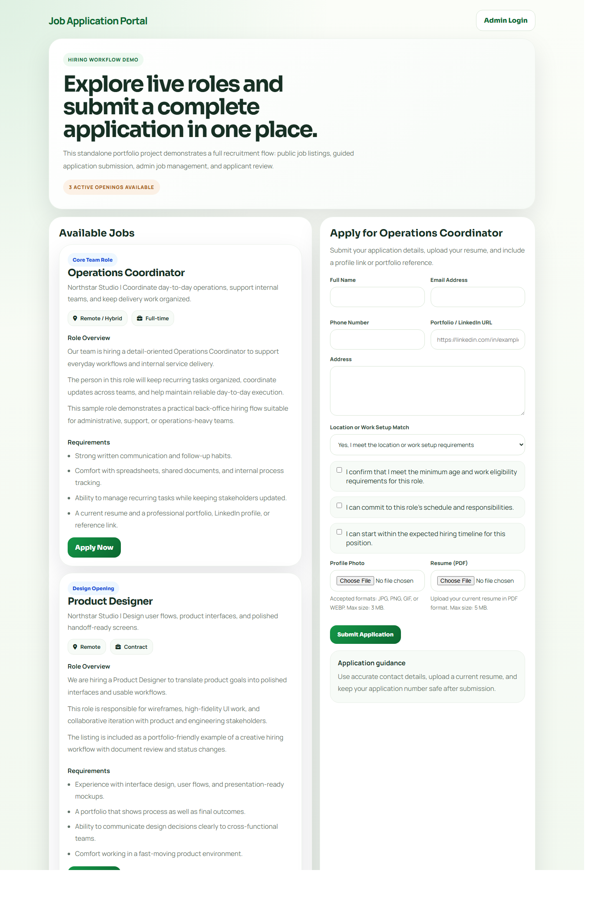
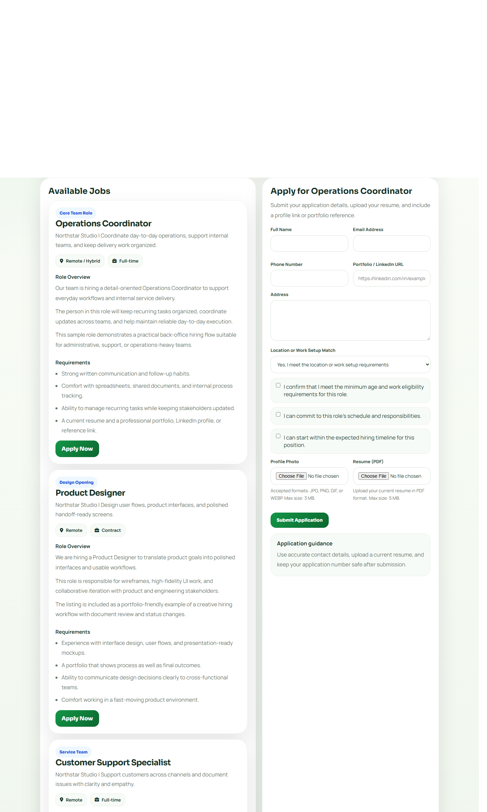
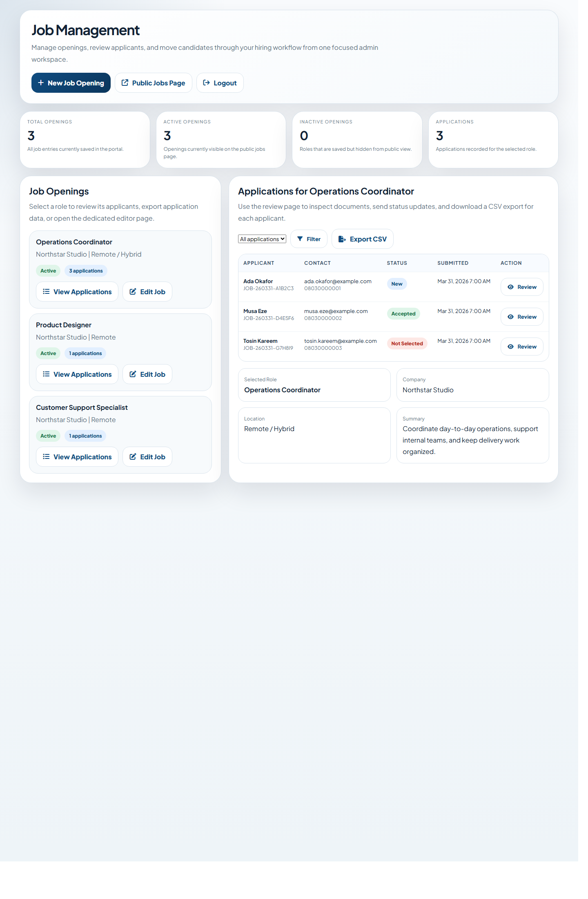
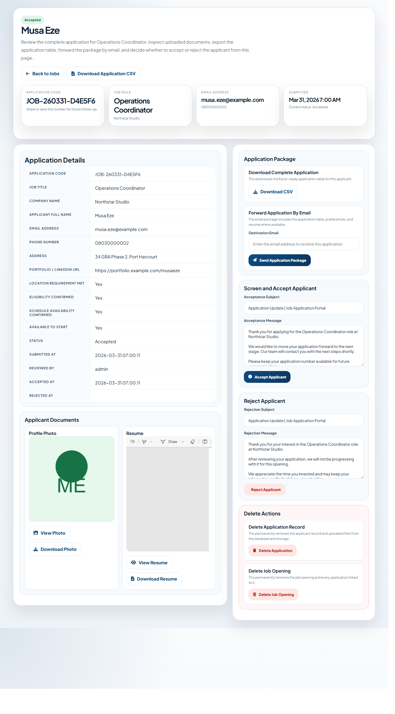

# Job Application Portal

A standalone PHP and MySQL recruitment workflow for managing public job applications and internal applicant review. It covers the full hiring loop from job discovery and application submission to admin-side job management, exports, and document handling.

## Why This Project Stands Out
- Clear separation between the public application experience and the admin workflow
- Real CRUD operations for openings, applicants, and workflow status changes
- File upload handling for resumes and profile photos
- CSV exports for applicant data
- Optional email messaging hooks for confirmations and review outcomes
- Demo-friendly setup with schema auto-creation, seeded sample roles, and a reusable sample dataset

## Screenshots

### Public Jobs Page

### Application Form

### Admin Dashboard

### Applicant Review

## Feature Overview
- Public jobs board with multiple sample openings
- Application form with validation, file uploads, and confirmation flow
- Admin login and protected management workspace
- Separate editor page for creating and updating job openings
- Applicant review page with status actions and CSV export
- Sample SQL dataset for restoring a clean demo state

## Tech Stack
- PHP
- MySQL / MariaDB
- HTML and inline CSS
- Font Awesome

## Project Structure
- `jobs.php`: public-facing jobs list and application flow
- `admin/login.php`: admin authentication page
- `admin/jobs.php`: admin dashboard for jobs and applicant lists
- `admin/job_opening.php`: dedicated editor for job details and templates
- `admin/job_application.php`: full applicant review page
- `database/sample_dataset.sql`: reusable demo dataset
- `includes/jobs_portal.php`: schema setup, portal logic, exports, uploads, and helpers

## Quick Start
1. Copy `config.local.example.php` to `config.local.php`.
2. Update the database and admin credentials in `config.local.php`.
3. Create the database named in `DB_NAME`.
4. Place the project inside your PHP web root.
5. Open `jobs.php` for the public page.
6. Open `admin/login.php` for the admin workspace.

## Demo Notes
- The database tables are created automatically on first load.
- Three sample job openings are seeded automatically.
- Import `database/sample_dataset.sql` if you want the same applicant data shown in the screenshots.
- Set `PORTAL_DEMO_AUTOLOGIN=1` in `config.local.php` for local-only demo capture.
- `config.local.php` is excluded from version control.

## Highlights
This project includes:
- PHP and MySQL application structure
- workflow-oriented admin UX
- public/admin route separation
- practical file upload and retrieval handling
- data export functionality
- product thinking around recruitment operations

## Contact
- Email: `cniorman6@gmail.com`
- Phone: `08164616531`

## License
This project is released under the MIT License by Seniorman Computers. See [LICENSE](LICENSE).
